# Software Engineering Methods

---
### Resources
| Resource name      |                                                 Link                                                  |
|--------------------|:-----------------------------------------------------------------------------------------------------:|
| Kanban board       |   <a href="https://zube.io/napier-258/world-population-system/w/workspace-1/kanban">Click here</a>    |
| Sprint Board       | <a href="https://zube.io/napier-258/world-population-system/w/workspace-1/sprintboard">Click here</a> |
| Lab material       |            <a href="https://github.com/Kevin-Sim/SET08103/tree/master/labs">Click here</a>            |
| Assessment material |         <a href="https://github.com/Kevin-Sim/SET08103/tree/master/assessment">Click here</a>         | 

### Repository Status
| Area          | Status                                                                                                                                  |
|---------------|-----------------------------------------------------------------------------------------------------------------------------------------|
| Master Branch |             |
| Develop Branch |           |
| License       |  |
| Releases      |      |
| Code coverage |  | 

## Contributors 

|                   | Code review 1 | Code review 2 | Code review 3 | Code review 4 | Final |
|-------------------|---------------|---------------|---------------|---------------|-------|
| 10009023 | 25%           | 25%           | 25%           | 25%           | 25%   |
| 40429143     | 25%           | 25%           | 25%           | 25%           | 25%   |
| 40544136         | 25%           | 25%           | 25%           | 25%           | 25%   |
| 40544143       | 25%           | 25%           | 25%           | 25%           | 25%   |

## Query Results
#### 32/32 Reports Complete

|  1  |               [All the countries in the world organised by largest population to smallest](https://github.com/tomgus1/sem/issues/15)               | Yes |  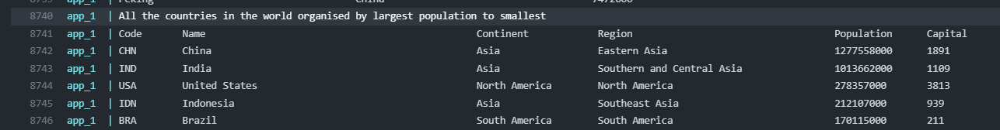  
|  2  |          [All the countries in a continent organised by largest population to smallest](https://github.com/tomgus1/sem/issues/15)           | Yes |  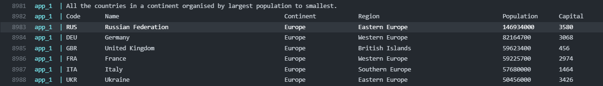  |
|  3  |         [All the countries in a region organised by largest population to smallest](https://github.com/tomgus1/sem/issues/15)          | Yes |  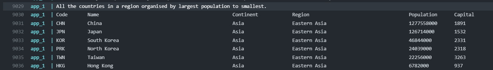  |
|  4  |               [The top N populated countries in the world where N is provided by the user](https://github.com/tomgus1/sem/issues/6)               | Yes |  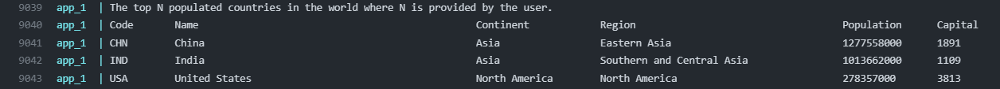  |
|  5  |         [The top N populated countries in a continent where N is provided by the user](https://github.com/tomgus1/sem/issues/16)          | Yes |  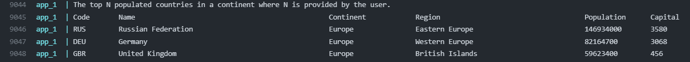  |
|  6  |        [The top N populated countries in a region where N is provided by the user](https://github.com/tomgus1/sem/issues/16)         | Yes |  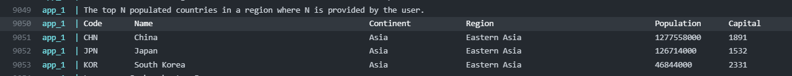  |
|  7  |                [All the cities in the world organised by largest population to smallest](https://github.com/tomgus1/sem/issues/17)                 | Yes |  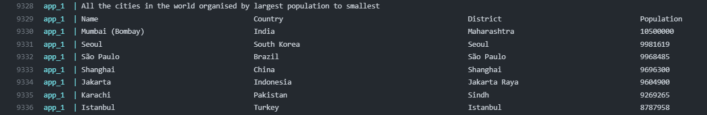  |
|  8  |          [All the cities in a continent organised by largest population to smallest](https://github.com/tomgus1/sem/issues/17)           | Yes |    |
|  9  |        [All the cities in a region organised by largest population to smallest](https://github.com/tomgus1/sem/issues/17)         | Yes |  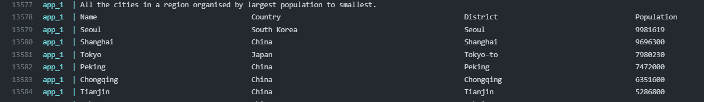  |
| 10  |       [All the cities in a country organised by largest population to smallest](https://github.com/tomgus1/sem/issues/17)        | Yes | 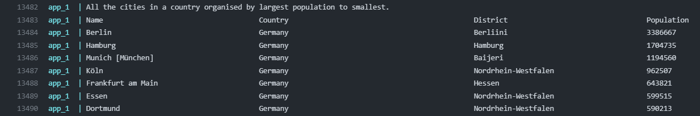 |
| 11  |          [All the cities in a district organised by largest population to smallest](https://github.com/tomgus1/sem/issues/17)          | Yes | 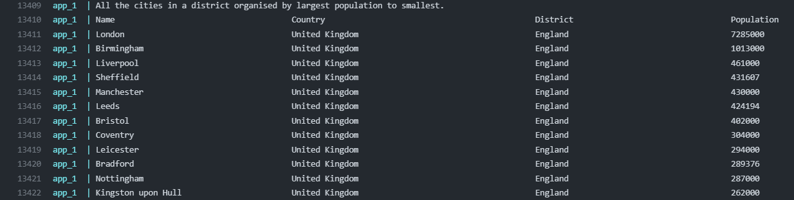 |
| 12  |                [The top N populated cities in the world where N is provided by the user](https://github.com/tomgus1/sem/issues/14)                | Yes | 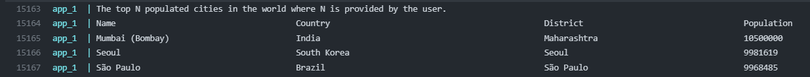 |
| 13  |       [The top N populated cities in a continent where N is provided by the user](https://github.com/tomgus1/sem/issues/14)       | Yes | 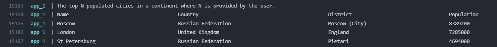 |
| 14  |        [The top N populated cities in a region where N is provided by the user](https://github.com/tomgus1/sem/issues/14)        | Yes | 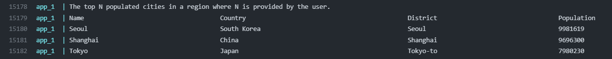 |
| 15  |     [The top N populated cities in a country where N is provided by the user](https://github.com/tomgus1/sem/issues/14)      | Yes | 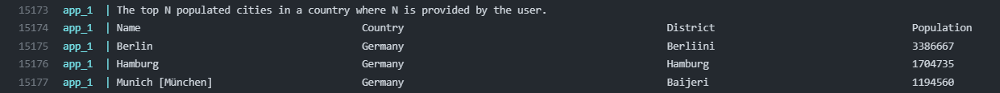 |
| 16  |         [The top N populated cities in a district where N is provided by the user](https://github.com/tomgus1/sem/issues/14)         | Yes | 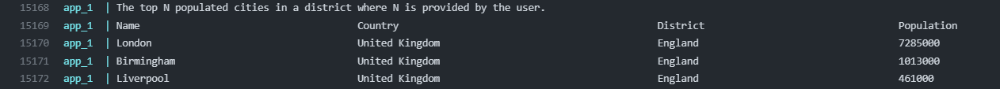 |
| 17  |            [All the capital cities in the world organised by largest population to smallest](https://github.com/tomgus1/sem/issues/20)            | Yes | 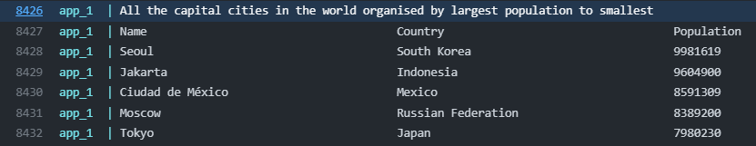 |
| 18  |      [All the capital cities in a continent organised by largest population to smallest](https://github.com/tomgus1/sem/issues/20)       | Yes | 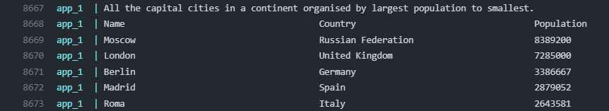 |
| 19  |         [All the capital cities in a region organised by largest to smallest](https://github.com/tomgus1/sem/issues/20)          | Yes | 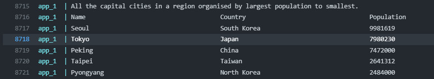 |
| 20  |            [The top N populated capital cities in the world where N is provided by the user](https://github.com/tomgus1/sem/issues/19)            | Yes | 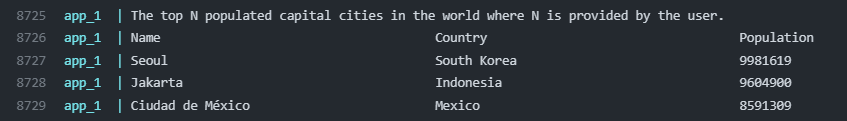 |
| 21  |   [The top N populated capital cities in a continent where N is provided by the user](https://github.com/tomgus1/sem/issues/19)   | Yes | 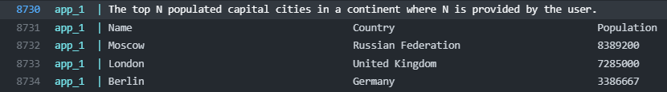 |
| 22  |     [The top N populated capital cities in a region where N is provided by the user](https://github.com/tomgus1/sem/issues/19)      | Yes |  |
| 23  | [The population of people, people living in cities, and people not living in cities in each continent)](https://github.com/tomgus1/sem/issues/56) | Yes | 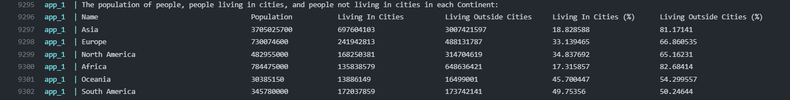 |
| 24  |  [The population of people, people living in cities, and people not living in cities in each region)](https://github.com/tomgus1/sem/issues/56)   | Yes | 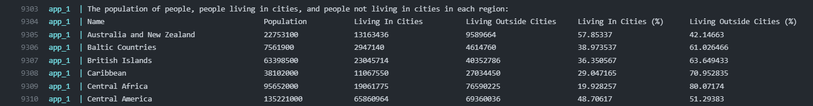 |
| 25  |  [The population of people, people living in cities, and people not living in cities in each country)](https://github.com/tomgus1/sem/issues/56)  | Yes |  |
| 26  |                                      [The population of the world](https://github.com/tomgus1/sem/issues/57)                                      | Yes |  |
| 27  |                                 [The population of a continent](https://github.com/tomgus1/sem/issues/57)                                  | Yes |  |
| 28  |                               [The population of a region](https://github.com/tomgus1/sem/issues/57)                                | Yes |  |
| 29  |                                 [The population of a country](https://github.com/tomgus1/sem/issues/57)                                 | Yes |  |
| 30  |                                [The population of a district](https://github.com/tomgus1/sem/issues/57)                                | Yes |  |
| 31  |                                   [The population of a city](https://github.com/tomgus1/sem/issues/57)                                   | Yes |  |
| 32  |                                        [Languages of the world](https://github.com/tomgus1/sem/issues/58)                                         | Yes | 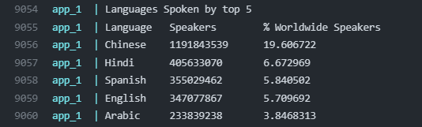 |
